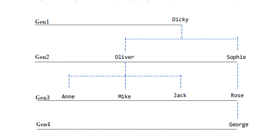

# Family-Tree-SWI-PROLOG

Consider the following family tree corresponding to the following Prolog program:

Males: Dicky, Oliver, Mike, Jack, George

Females: Anne, Rose, Sophia

Define new predicates for the following family relations: Father, Mother, Sister, Brother,
Grandmother, Grandfather, Ancestor, Cousin, Uncle, Son and Daughter.
